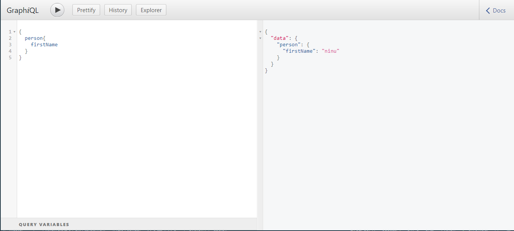

<h1 align="center">
  
     <!-- height="80"/><br> -->
Strawberry  GraphQL 🍓- API Tutorial
</h1>

<p align="center">
Strawberry is Python GraphQL library based on dataclasses.
</p>

<!-- <p align="center">
  
  <!-- | -->
 <!-- 
  <!-- | -->
<!-- </p> -->

</p>

<br>
<br>

### ⚙️ Steps


```sh
# install strawberry-graphql
pip install -r requirements.txt 

# create app.py having all the straberry graphql server schema, mutations etc.

# run server
strawberry server app

```

### 📄 Bug reports, feature requests, etc

This is an ongoing project and I welcome contributions and suggestions! Feel free to submit a PR.

<!-- tutorial links -->
<!--  https://strawberry.rocks/docs -->
<!-- https://www.youtube.com/watch?v=J9AYhCmKMzo -->
